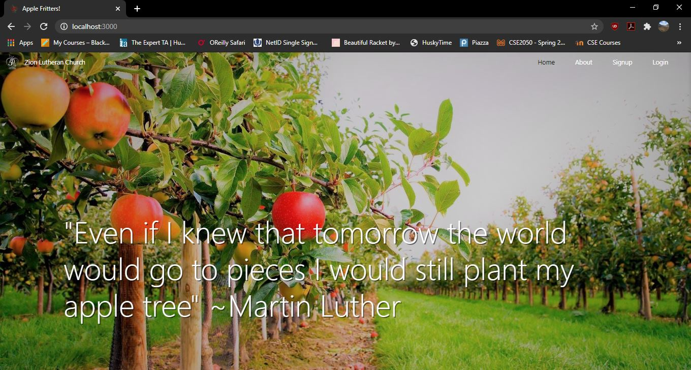
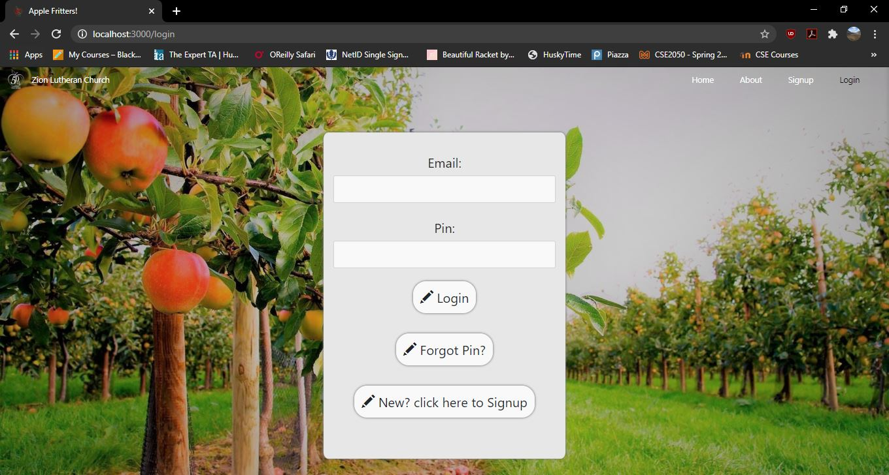
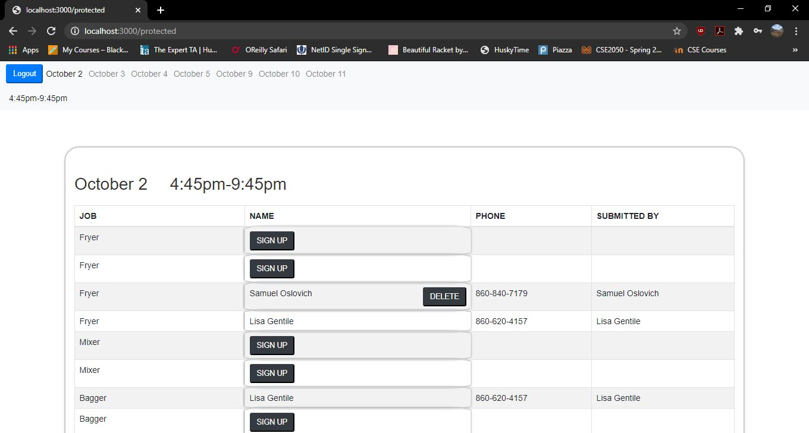
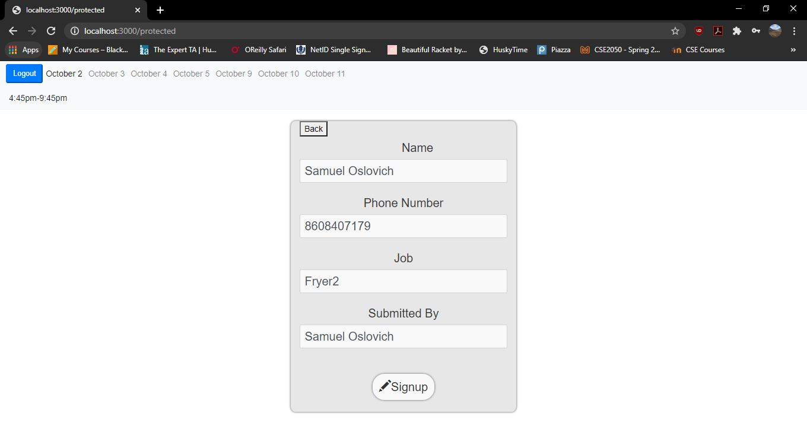

# ChurchWeb
---
A website for helping Zion Lutheran Church with organizing volunteers for their popular Apple Fritter Booth Fundraiser.
---
# A quick overview of the site
## The Homepage

- The homepage is what the user sees when they first open up the website. The are welcomed with a picture of an apple orchard and a quote by Martin Luther.
## About

- The about page gives information about how Zion Lutheran Church began selling apple fritters at the harvest festival.
## Signup

- The signup page allows new users to create an account. Once an account is created the new user is given a pin to sign into the site. (All user info is stored in a MongoDB Database)
## Login

- The user can login using their email and their generated pin. Their info is checked against the info in the database and if it matches they are logged in and redirected to the protected page.
## Protected

- This page has a table view showing all the possible jobs that the user can volunteer to sign up for. They can also choose a date and shift time to sign up for. If a user realizes they signed up for the incorrect time or job they can delete their submission.
## Protected Signup

- This page shows the user what job they signed up for and allows them to input a different phone number and name in, if they want to sign a friend or family member up to volunteer.
---
# Technologies Used
## Frontend
- The frontend uses .ejs partial views for the ability to reuse common components. The frontend also uses bootstrap for styling. 
## Backend
- The backend uses Express JS in an MVC format. 
## Data Layer
- All of the data is stored in a MongoDB Database.
